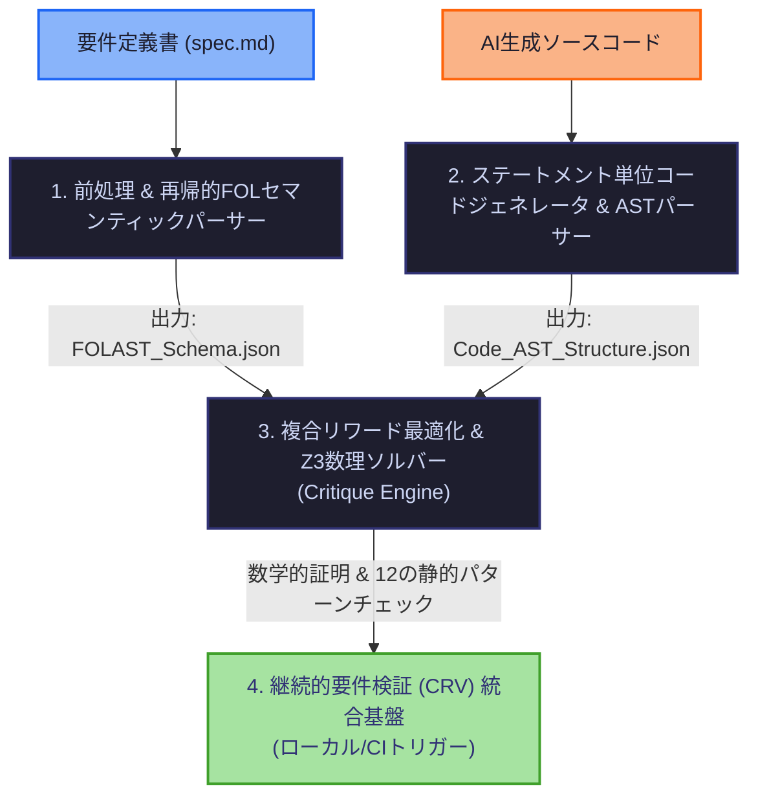

# 仕様書：継続的要件・ロジック検証パイプライン（ReqOpsゲート）V2

## 1. 概要と数理的ビジョン

### 1.1 背景と目的
AI駆動開発（AIDD）において、LLMによるソースコードの直接生成は、ハルシネーションやロジックの抜け漏れ（Logic Omission）、効率性の低下を内包しています [8]。既存の多くのコード生成AIは、正しさ（機能的正確性）のみに焦点を当てがちであり [17]、生成されたコードの実行時間やメモリ使用効率といった非機能要件が犠牲になるケースが多発しています [8, 18]。EffiBenchのベンチマークデータによると、LLMが生成したコードの実行時間は人間が書いたコードの2.59〜3.44倍を要し、最悪のケースでは68倍もの遅延が発生することが実証されています [21]。

本プロジェクトは、ソフトウェア工学における古典的な難所である「要求工学（Requirements Engineering）」の上流工程（仕様策定・矛盾分析）[1955, 1985] と、「実装コード（AST）」の下流工程 [27] を、Google Cloud（Vertex AI）[108] および数理ソルバー [1185, 1215] を介して決定論的に結合する**ReqOps品質ゲート基盤**をローカル環境およびCI/CD環境向けに定義するものです [2045, 2686]。

### 1.2 コアアーキテクチャの原則：ツリーによる挟み撃ち
> **「確率的な生成AI（LLM）の出力を、決定論的な論理構造（ツリー）で挟み撃ちにして統治する」**

本システムは、LLMの確率的な揺らぎ（Perplexity依存による非効率なコード生成）を制御するため [8, 396]、上流の**一階述語論理抽象構文木（FOLAST）** [1154, 1182] と、下流のコードから抽出された**抽象構文木（AST）** [27] という2つの厳格なデータ構造で生成プロセスを挟み込み、数学的な整合性と実行効率性を検証します [55, 1154]。

---

## 2. システムコンポーネントとマルチエージェント構成

本アプリケーションは、**Antigravity 2.0の並行サブエージェント**によって自律実装されるよう、以下の4つのモジュールにインフラレベルで疎結合化されます。



### 2.1 モジュールA：前処理 & 再帰的FOLセマンティックパーサー（最上流ゲート）
自然言語の要件を、単一ステップのテキスト変換ではなく [1178]、**再帰的トップダウンセマンティックパース（Recursive Top-Down Semantic Parsing）**によって構造化します [1154, 1259]。

1. **文境界検出（Preprocessing）：** 略語（例: `U.S.`, `Prof.`）や数値表現による不適切な断片化を防ぐため [1228]、単純な句読点による分割ではなく、機械学習ベースの文境界検出モデル**SaT（Segment Any Text）**を採用して要件定義（`spec.md`）を独立した論理文に分離します [1227, 1629, 1630]。
2. **階層的サブモジュールパース：** 抽出された各文は、以下の再帰ループを通じて処理されます [1315]。
   * **ParserSelector:** 文の構造を「A: 原子論理文」「B: 量化論理文」「C: 複合論理文」「D: 否定論理文」に分類します [1315, 1316]。
   * **LogicalSentenceParser:** 外部の論理演算子（$\land, \lor, \rightarrow, \leftrightarrow$）を検出し [1208]、文を右・左のオペランドに分割して再帰呼び出しを実行します [1319, 1320, 1745]。
   * **QuantifiedSentenceParser:** 全称量化（$\forall$）や存在量化（$\exists$）のスコープと変数を抽出し [1208, 1318]、内部スコープを再帰的に処理します [1318, 1320]。
   * **AtomicSentenceParser:** 最下層の原子文から、国際規格**ISO 25010**（機能要件、信頼性、効率性など）に準拠した形式で [2650, 2660]、述語（Relation）と引数（Constants/Variables）を確定させます [1208, 1317]。
* **出力:** `FOLAST_Schema.json` [1182]

### 2.2 モジュールB：ステートメント単位コードジェネレータ & ASTパーサー
1. **中間選択（Per-statement Selection）デコーディング：** 生成モデルによるコード生成時、トークン単位の探索に加えて、改行（`\n`, `\r`）を区切りとする**ステートメント（行）レベルでの中間評価**を探索アルゴリズム（ビーム幅 $b=1$, Best-of-$n$ 試行数 $n=50$）に適用し [97, 98, 970]、効率的な解の探索空間をincrementalに構築します [96, 1011]。
2. **AST変換処理：** テキストの表記揺れ（スペースやフォーマットの差異）を完全に排除し、純粋な制御フローと動作構造のみを抽出するため、コードを抽象構文木（AST）へと静的にパースします [27, 73]。
* **出力:** `Code_AST_Structure.json` [73]

### 2.3 モジュールC：複合リワード最適化 & Z3数理ソルバー（Critique Engine）
確率的なLLMの挙動を制御するため、**数理ソルバー（決定論）**と**LLM-as-a-Critique（意味論）**のハイブリッドリワードを適用します [91, 1154]。

#### 複合報酬関数（Composite Scoring Function）の数理定義
すべてのステートメントレベルにおいて、以下の最適化関数を最大化するコードを採択します [91, 98]。
$$r(y_{\le l}, q) = \alpha \cdot r_{AST}(y_{\le l}) + \beta \cdot r_{LLM}(y_{\le l}, q) - \gamma \cdot PP(y_{\le l} | f_{\theta})$$
※ $PP$ は Perplexity（尤度推定）を示し [91, 92]、$\alpha, \beta, \gamma$ は各報酬成分の寄与度を調整するハイパーパラメータです [92]。

#### 静的ASTパターンリワード（$r_{AST}$）の定義
コード構造に潜む**12のパフォーマンス・アンチパターン**を静的に検出し [55, 71, 72]、以下の数式でペナルティ（$\delta_p$）を課して正規化（$[0, 1]$）します [75, 76, 77]。
$$r_{AST}(y_{\le l}) = 1 - \frac{\sum_{p \in \mathcal{P}} \delta_p \cdot I[p \in AST(y_{\le l})]}{\sum_{p \in \mathcal{P}} \delta_p}$$
※ $I$ はインジケーター関数であり、アンチパターン $p$ がAST内に存在する場合に 1、それ以外は 0 となります [77, 79]。

##### 【12のペナルティ割り当て規則表】 [72, 830-962]
| ID | アンチパターン名（仕様） | ペナルティ（$\delta_p$） | ソースコード検出ロジック（ベースライン） |
| :--- | :--- | :--- | :--- |
| 1 | **Nested Loops**（多重ループ） [72] | $\delta = 10$ [834] | `ast.For` または `ast.While` の内部におけるループノードの重複 [837-840] |
| 2 | **Redundant Function Calls inside Loops** [72] | $\delta = 8$ [844] | ループの `body` 内における高コスト関数の繰り返し呼び出し [847-851] |
| 3 | **Redundant Function Calls for Memoization** [72] | $\delta = 6$ [857] | 同一引数を持つ高コスト関数呼び出し（メモ化の未適用） [854, 860-867] |
| 4 | **Inefficient Use of Data Structures** [72] | $\delta = 6$ [873] | List（配列）ノードに対する `ast.Compare`（所属テスト `in`）の実行 [875, 876] |
| 5 | **Excessive Function Calls in Loops** [72] | $\delta = 7$ [879] | ループ内で繰り返し実行されるコストの高い特定メソッドの検出 [881-885] |
| 6 | **Unnecessary Recursion** [72] | $\delta = 12$ [889] | `ast.FunctionDef` 内での、自身と同名の `ast.Call` ノードの存在 [891-893] |
| 7 | **Deeply Nested Conditions** [72] | $\delta = 4$ [899] | `ast.If` ノードの親を遡った際の、ネスト深さが 3 を超える構造 [901-907] |
| 8 | **Inefficient String Concatenation** [72] | $\delta = 6$ [913] | ループ内での `ast.BinOp` と `ast.Add`（`+`）による文字列結合 [915-919] |
| 9 | **Inefficient File/Database Operations** [72] | $\delta = 10$ [924] | `ast.With` コンテキスト内での `open`, `execute`, `query` のループ内実行 [926-930] |
| 10 | **Large Functions** [72] | $\delta = 8$ [937] | `ast.FunctionDef` の `body` 長（行数）が 20 を超える巨大関数 [939-941] |
| 11 | **Inefficient Loop Terminology** [72] | $\delta = 6$ [949] | `ast.For` のイテレータにおける `range(len(...))` 構造の検出 [951-956] |
| 12 | **Potential Syntax Errors** [72] | $\delta = 20$ [962] | `ast.parse(code)` 実行時に `SyntaxError` 例外が発生する不完全なコード [959-962] |

#### 2パス・ジェネレーター・アルゴリズムによるZ3照合
モジュールAの `FOLAST` から、**2パス・コンパイル・アルゴリズム**によってZ3実行用コードを決定論的に自動生成します [1184, 1345, 1348]。
* **1stパス（Declaration Collection）：** 全ノードを先行順（Preorder）で走査し、定数（Constants）、変数（Variables）、関係（Relations）のシグネチャを抽出し、グローバルなシンボルテーブル（環境）に登録します [1348, 1352-1354]。
* **2ndパス（Expression Generation）：** スコープのバインディング、演算子の優先順位を厳密に考慮し、`s.add(...)` 形式のAssertion式としてアセンブルします [1349, 1372-1375]。

数理ソルバー（Z3）で反例が検出された、または論理的な不一致が生じた場合は、Vertex AI上のプロンプト（時間/空間複雑度、実行時間、メモリ効率、AST構造分析評価）に基づいてLLMが**Critique（批評役）**として介入し [27, 84, 85]、プログラムの該当行を特定して自己修復ループ（Self-Correction）をキックします [51, 1154]。
本アプローチの導入により、従来のコード生成（Perplexityのみ）と比較して**平均実行時間を最大70.6%削減、最大メモリ使用量を13.6%削減**できることがベンチマークにより実証されています [11]。

### 2.4 モジュールD：GitOps CI/CD 統合基盤（ReqOpsパイプライン）
1. **継続的要件検証（Continuous Requirements Verification）：** 開発者が `spec.md` またはソースコードを変更してプルリクエスト（PR）を発行した瞬間、ローカルフックまたはCloud Buildトリガーが起動します [2045, 2304]。これにより、手戻りコストが最も高い下流工程での仕様バグ発覚を未然に防ぎます [1963, 2044]。
2. **トレーサビリティ・リンク分析（TLR）：** 変更された要件が、既存のテストケース、設計モデル、コードASTのどのノードに影響を与えるかを、「前処理（Preprocessing）」「リンク生成（Link Generation）」「リンク洗練（Link Refinement）」の3フェーズ（Traceability Link Recovery）で自動追跡します [2187, 2189]。
3. **リスク評価ゲート：** 要件リスク予測モデルとして**Credal Decision Tree（CDT）**を呼び出し [2972, 2973]、10フォールドクロスバリデーションにおいて98%の精度でプロジェクトの不達リスクを予測します [2973]。論理検証が不合格の場合はマージを自動ブロックし、GitHubのPR上に構造的デバッグコメントをインラインで投稿します。

---

## 3. データスキーマ定義

### 3.1 一階述語論理抽象構文木スキーマ（`FOLAST_Schema.json`）
自然言語の論理関係を再帰的に内包できる、厳格なFOLAST構造を定義します [1182, 1213]。

```json
{
  "$schema": "http://json-schema.org/draft-07/schema#",
  "title": "FirstOrderLogicAST",
  "type": "object",
  "properties": {
    "node_type": { 
      "type": "string", 
      "enum": ["Atomic", "Quantified", "Logical", "Negation"] 
    },
    "operator": { 
      "type": "string", 
      "enum": ["And", "Or", "If", "OnlyIf", "IfAndOnlyIf", "Not", "ForAll", "ThereExists", "None"] 
    },
    "variable": { "type": "string" },
    "predicate_name": { "type": "string" },
    "arguments": {
      "type": "array",
      "items": {
        "type": "object",
        "properties": {
          "type": { "type": "string", "enum": ["Constant", "Variable"] },
          "name": { "type": "string" }
        },
        "required": ["type", "name"]
      }
    },
    "left_operand": { "$ref": "#" },
    "right_operand": { "$ref": "#" },
    "scope": { "$ref": "#" }
  },
  "required": ["node_type", "operator"]
}
```